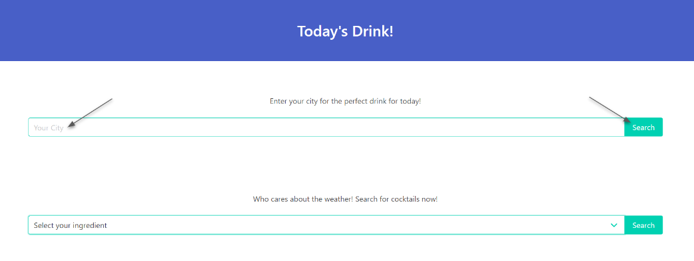
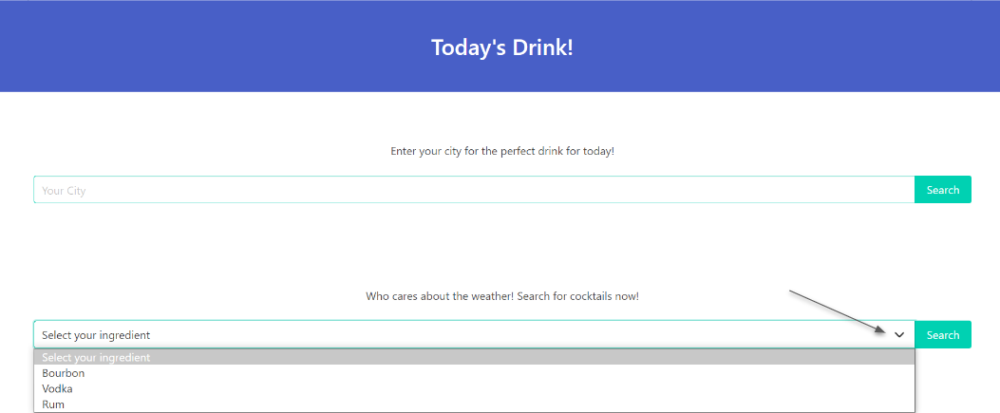
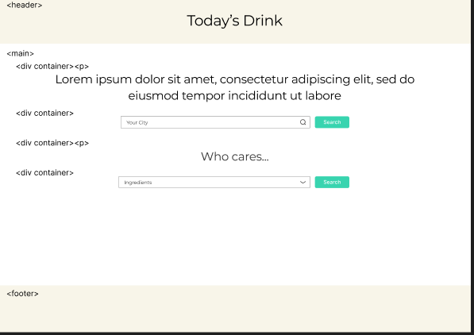
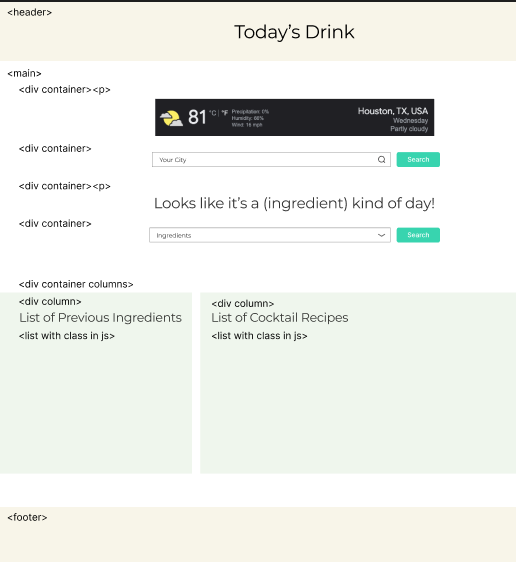

# Today's Drink

`https://mzernick.github.io/Drink-of-the-Day/`
Version 1.0
Deployment Date: January 17, 2023

Contributors: Anita Banh, Magdalene Zernick, Saineha Shetty, Jessica Ortega

#Purpose

Today's Drink is an application that suggests a beverage for a location based on the current weather conditions. From the application you can search for a location by city name and the app will display current weather conditions and suggest an ingredient. Alternatively, who cares what the weather is- bypass weather search all together and select an ingredient from the options- the application will display a curated list of beverage recipes.

# Getting Started

Enter a city, then click Search.

Or select an ingredient, then click Search.

# Instructions

1. Type a city in the first search field and click the search button to the right of this field.
2. Current weather will appear above the search field. A suggested ingredient will appear below the search field.
3. Select an ingredient from the dropdown.
4. A list of previously searched ingredients as well as cocktail recipes will appear below the Ingredients dropdown.
5. Previously searched ingredients will appear below the ingredients dropdown.

# User Story

AS A user I want a cocktail recipe based on the current weather
I WANT to pick my city
SO THAT I can recieve a cocktail recipe recommendation and the option to browse if I don't like what is provided

# Built Using

Bulma CSS: https://bulma.io/

# Authors

* Jessica Ortega: https://github.com/JessicaIOrtega
* Saineha Shetty: https://github.com/ney2thehey
* Anita Banh: https://github.com/AnitaBanh
* Magdalene Zernick: https://github.com/MZernick

# Original Idea

 Load page

Search results page

# IceBox

Ideas pending for possible future development:

1. Additional ingredient options
2. Additional drink recipes
3. Randomize drink recipes

## License

Matter.js is licensed under the MIT License - see the [LICENSE.md](https://github.com/minaslater/Cannon-Game/blob/master/LICENSE.md) file for details
